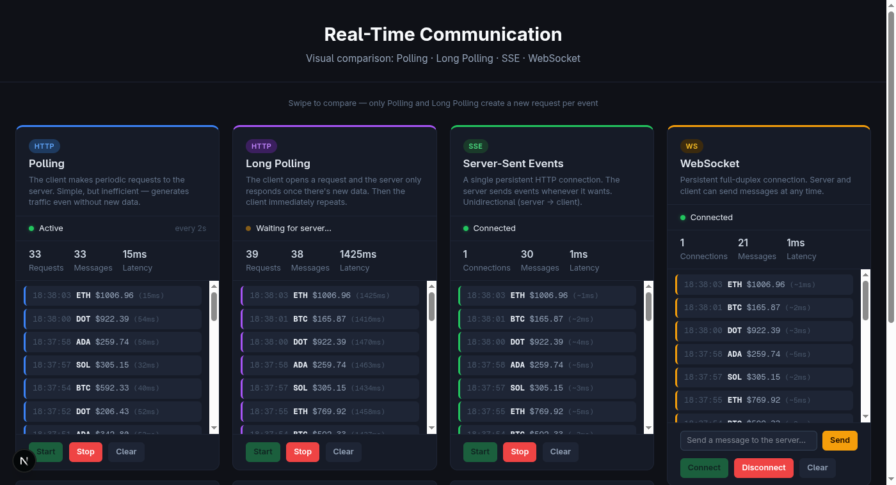

# Real-Time Communication on the Web

[](https://github.com/MGuerreiro42/realtime-comunication-talk/actions/workflows/ci.yml)
[](LICENSE)


Presentation material and interactive demo comparing the four main approaches to real-time communication on the web: Polling, Long Polling, Server-Sent Events, and WebSocket.

> The slide deck exists in both languages: [`docs/en/`](docs/en/) and the original [`docs/pt-BR/`](docs/pt-BR/), which documents a TechTalk actually delivered in Portuguese.



---

## Repository contents

```
/
├── docs/
│   ├── en/                    # Slide deck, English translation
│   │   ├── 00-index.md
│   │   ├── 01-the-problem.md
│   │   ├── 02-classic-http.md
│   │   ├── 03-polling-long-polling.md
│   │   ├── 04a-http-1-and-2.md
│   │   ├── 04b-http3-quic.md
│   │   ├── 05-sse.md
│   │   ├── 06-websocket.md
│   │   ├── 07-beyond-the-basics.md
│   │   ├── 08-how-to-choose.md
│   │   └── 09-security.md
│   └── pt-BR/                 # Slide deck, original Portuguese (Markdown / Obsidian)
│       ├── 00-indice.md
│       ├── 01-o-problema.md
│       ├── 02-http-classico.md
│       ├── 03-polling-long-polling.md
│       ├── 04a-http-1-e-2.md
│       ├── 04b-http3-quic.md
│       ├── 05-sse.md
│       ├── 06-websocket.md
│       ├── 07-alem-do-basico.md
│       ├── 08-como-escolher.md
│       └── 09-seguranca.md
├── demo/
│   ├── api/                    # Express + ws backend — the four endpoints below
│   │   └── server.js
│   └── web/                    # Next.js frontend for the interactive demo
│       ├── app/
│       ├── components/
│       ├── hooks/               # one hook per technique's connection logic
│       └── lib/constants.ts     # per-technique copy, colors, and static config
└── .github/workflows/ci.yml    # typecheck + lint + build (web), install + smoke test (api)
```

---

## Demo

A Node.js/Express server (`demo/api`) with four endpoints running in parallel, and a Next.js frontend (`demo/web`) that connects to all of them simultaneously and shows the behavior of each in real time.

The server simulates a crypto price feed — a new event every 1.5 seconds — and the client displays how each technology receives those events, with request counters, measured latency, and a cumulative-connections visualizer that makes the cost of each approach visible.

### What each panel shows

**Polling** — the client makes a GET every 2 seconds regardless of whether there's new data. The request counter keeps climbing even in silence. This is the cost of the pull model in its rawest form.

**Long Polling** — the client opens a request and the server holds it until there's an event. The request sits "pending" in the DevTools Network tab. Once data arrives, the client reconnects immediately. Near-zero latency, but one new HTTP request per event.

**SSE** — a single persistent HTTP connection. The server pushes events as they happen. The request counter stays at 1 forever — that's the point of the slide.

**WebSocket** — full-duplex connection. Besides receiving events from the server, you can send messages and see the server's timestamped echo, illustrating the bidirectionality that SSE doesn't have.

Below the `md` breakpoint, the four panels become full-screen, scroll-snapped slides — swipe horizontally to move between techniques, one at a time, instead of scanning a cramped four-column grid.

### How to run it

Two terminals — the API and the frontend run as separate processes:

```bash
# Terminal 1 — API (http://localhost:3000)
cd demo/api
npm install
node server.js

# Terminal 2 — frontend (http://localhost:3001)
cd demo/web
pnpm install
pnpm dev
```

Open `http://localhost:3001` and start whichever panels you want to compare. Keeping the DevTools Network tab open alongside it is recommended — the difference between "one request that never closes" (SSE) and "one request per event" (Long Polling) becomes immediately visible.

### Endpoints

| Method | Path | Description |
|---|---|---|
| GET | `/api/polling` | Returns current state immediately |
| GET | `/api/long-polling` | Holds until the next event |
| GET | `/api/sse` | Persistent `text/event-stream` stream |
| WS | `/ws` | Full-duplex WebSocket connection |

---

## Material

The files form a linear narrative from the problem to next-generation technologies, aimed at engineers already familiar with web development. Read [`docs/en/00-index.md`](docs/en/00-index.md) or [`docs/pt-BR/00-indice.md`](docs/pt-BR/00-indice.md) for the suggested reading order. Both folders are Obsidian-compatible — `[[]]` links work if you open either one as a vault.

The `05-sse.md` module ([en](docs/en/05-sse.md) / [pt-BR](docs/pt-BR/05-sse.md)) includes a React hook implementation (`useSSE`) with exponential backoff, jitter to avoid thundering herd, stable callbacks via `useLatestRef`, and memory-leak cleanup — plus the reasoning behind each of those safeguards.

---

## Tech

- **API** (`demo/api`): Node.js with `express` and `ws`
- **Frontend** (`demo/web`): Next.js (App Router, TypeScript, Tailwind CSS v4)

---

## License

MIT — see [LICENSE](LICENSE).
